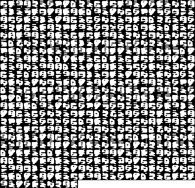
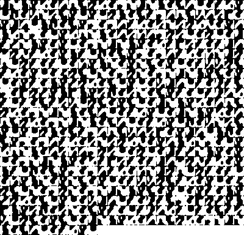
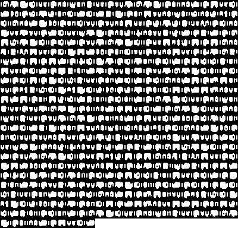
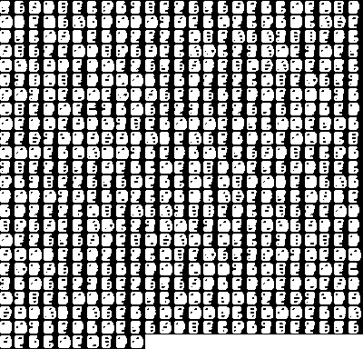

# NeuraGlyph 

## Overview

NeuraGlyph is a side project that uses NNs to generate an entirely new alphabet from scratch. It can be also considered as a neural network-based encryption and decryption tool designed for text. It generates images from text, effectively establishing a new language. The model uses noise to alter the generated characters, making it highly effective for encryption. Without the corresponding decryption model, it's nearly impossible to decode the text visually because characters change each time.

## Features

- **Text-to-Image Generation**: Converts text into unique images.
- **Self-Generated Alphabet**: The model can create its own characters, forming a new language.
- **Noise-Based Encryption**: The characters change dynamically based on input noise, preventing direct visual learning of the alphabet.

## Why It's Good for Encryption

This encryption method is particularly secure because the characters generated by the model are influenced by noise. This makes it difficult for anyone to learn the alphabet or decode the text visually. To decrypt the text, one must use the decryption model, which is also based on a neural network, ensuring that the encryption is not easily bypassed.

## How to Run It

Here I provide some examples on how to use the tool. The training takes approximately a minute or two on an Intel N100.
First, you'd need to put your custom text in a file somewhere and use it (otherwise you can just use the built-in text file).

Train, encrypt and decrypt the built-in text. The included text and images are stored at `data/`.
```bash
python run.py --train --encrypt --decrypt
```

Train, encrypt and decrypt a custom text and dump the image into a custom location.
```bash
python run.py --train --encrypt --text_file <path-to-text> --decrypt --image_file <path-to-output-image-png>
```

Train and encrypt some custom text.
```bash
python run.py --train --encrypt --text_file <path-to-text>
```

Decrypt some image using a pretrained model
```bash
python run.py--decrypt --image_file <path-to-output-image-png> --dump_dir <parent-dir-to-pth-models>
```

There are of course other parameters to play with, for that please check `utils/config.py`

## Experimentation

Feel free to experiment with the following parameters that control the generated alphabet to generate different variants and see how the model adapts to various inputs:
```bash
python run.py --train --encrypt --decrypt --connectivity 15 --sparsity 1 --smoothness 0.1  --line_width 0.00002 --density 0.6 --temperature 0.5
```
The parameters are self-explanatory and represent the weight of each parameter in the loss function.

## Examples
You can use the built-in text to generate some fun example and share interesting combinations.
Here are some example that demonstrate how the tool functions - each small square is a letter from the text - one could use the decrypter to recover the text from the image:


Text:
```commandline
Lorem ipsum dolor sit amet, consetetur sadipscing elitr, sed diam nonumy eirmod tempor invidunt ut labore et dolore
 magna aliquyam erat, sed diam voluptua. At vero eos et accusam et justo duo dolores et ea rebum. Stet clita kasd 
 gubergren, no sea takimata sanctus est Lorem ipsum dolor sit amet. Lorem ipsum dolor sit amet, consetetur sadipscing
  elitr, sed diam nonumy eirmod tempor invidunt ut labore et dolore magna aliquyam erat, sed diam voluptua. 
  At vero eos et accusam et justo duo dolores et ea rebum. Stet clita kasd gubergren, no sea takimata sanctus 
  est Lorem ipsum dolor sit amet.
```

The "numbers" font:
```bash
python run.py --train --encrypt --decrypt --connectivity 5 --sparsity 5 --smoothness 0.1  --line_width 0 --density 0.5 --temperature 0.5
```
<p align="center">
  
</p>


The military font:
```bash
python run.py --train --encrypt --decrypt --connectivity 5 --sparsity 15 --smoothness 0.1  --line_width 0.00002 --density 0.5 --temperature 0.5
```
<p align="center">
  
</p>

The C-U font
```bash
python run.py --train --encrypt --decrypt --connectivity 10 --sparsity 1 --smoothness 0.1  --line_width 0.00001 --density 0.4 --temperature 0.5
```
<p align="center">
  
</p>

The looking face font
```bash
python run.py --train --encrypt --decrypt --connectivity 15 --sparsity 1 --smoothness 0.1  --line_width 0.00002 --density 0.6 --temperature 0.5
```
<p align="center">
  
</p>
